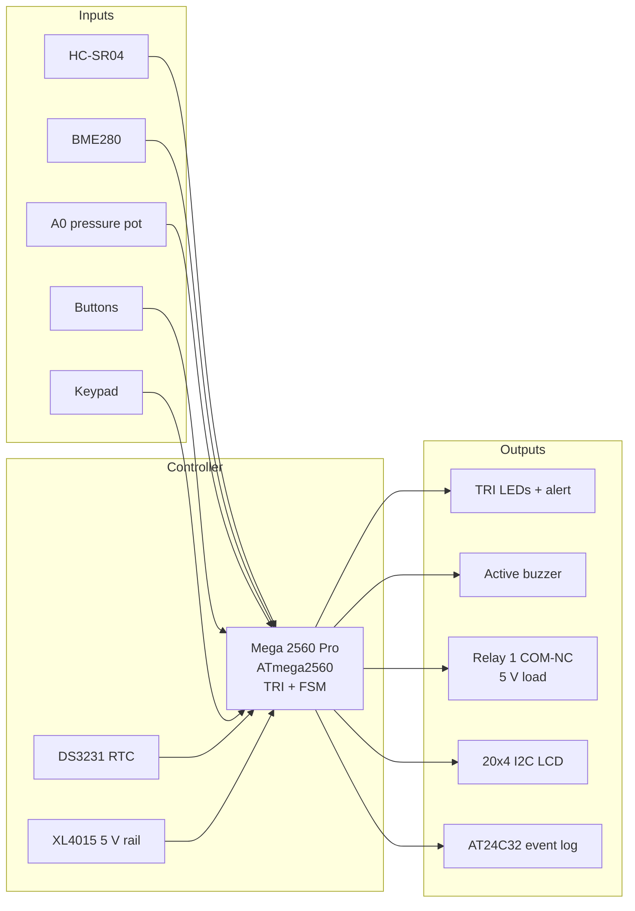
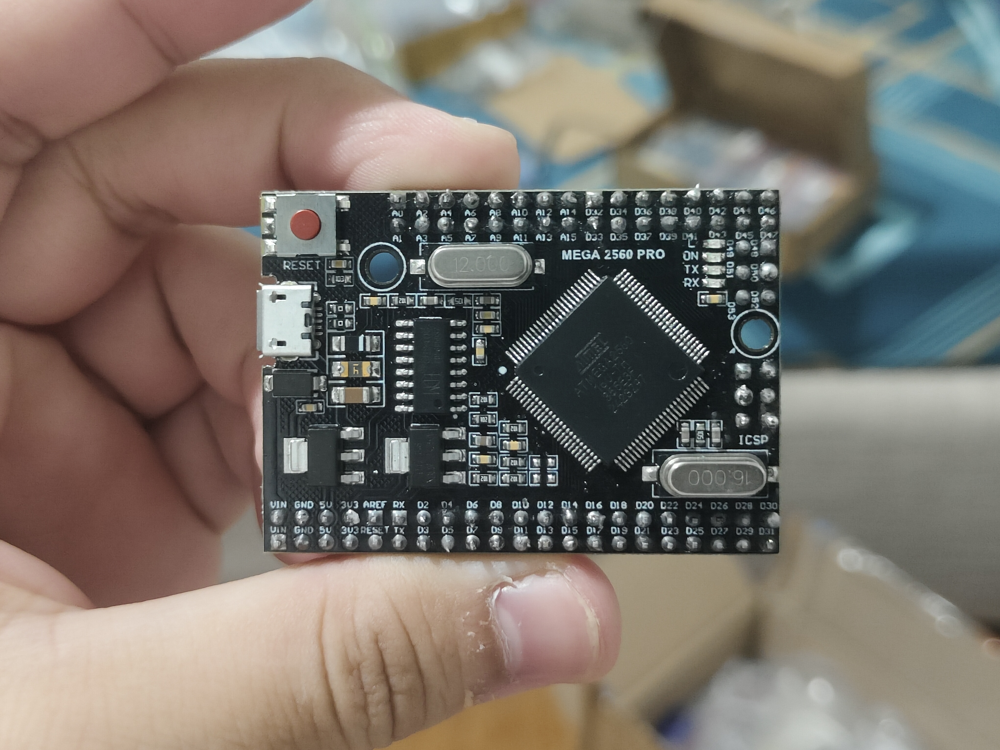
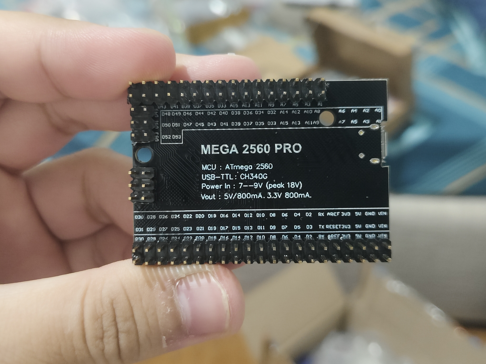
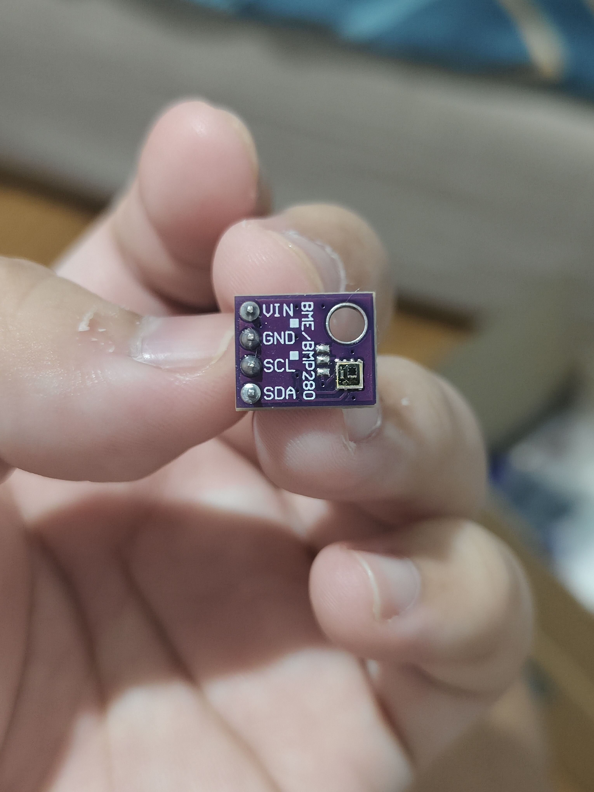
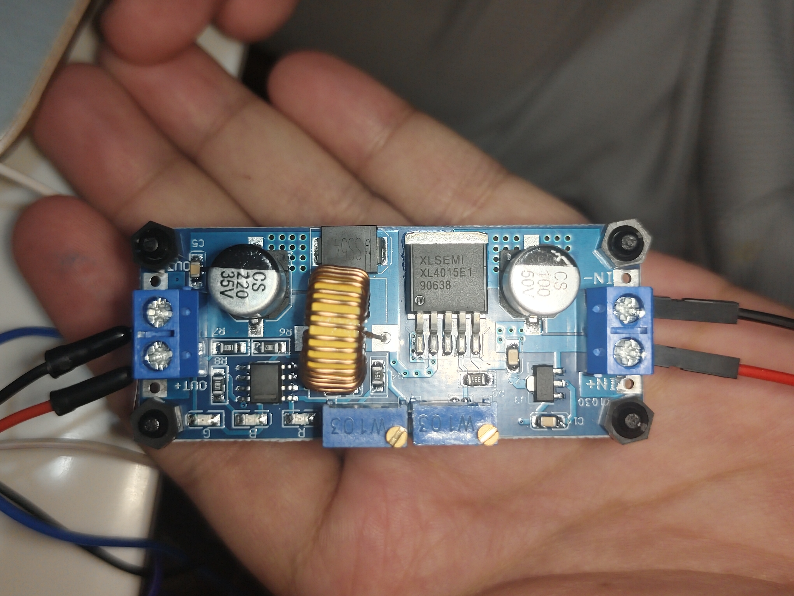
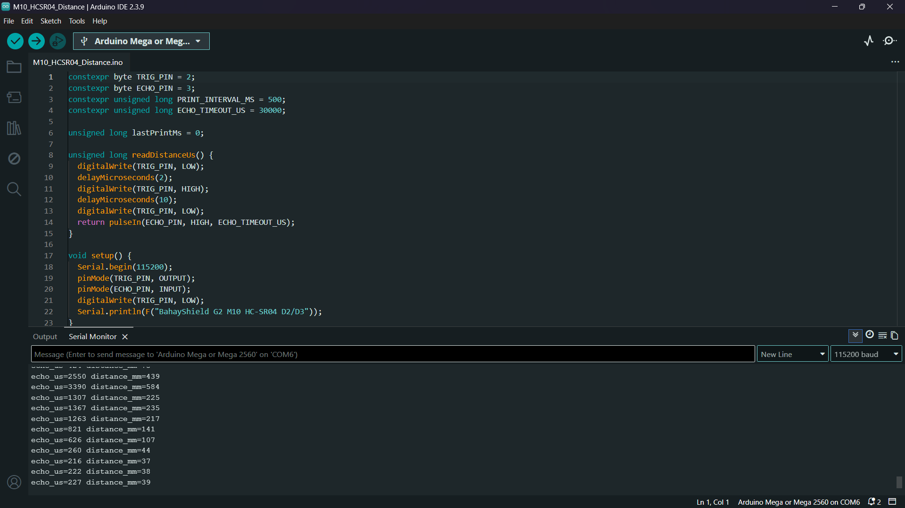
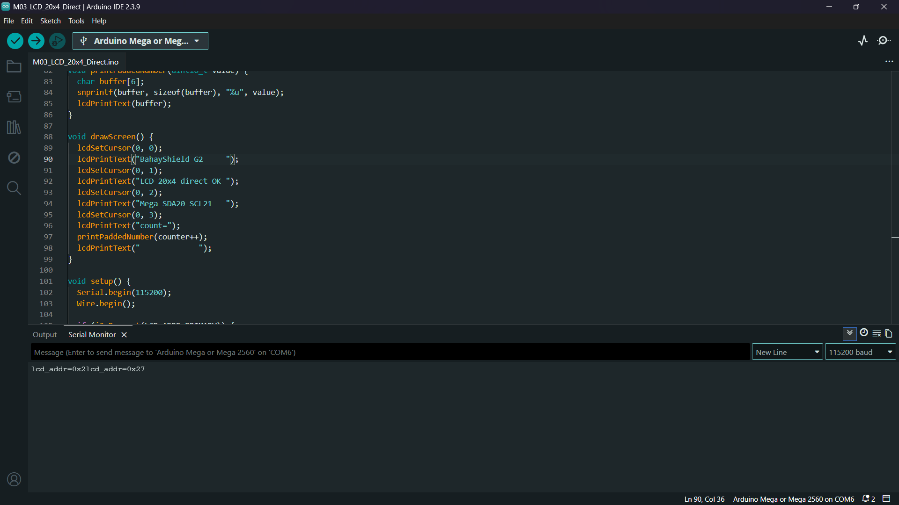

# BahayShield ULTRA

<p align="center">
  <strong>Offline flood and typhoon preparedness controller for a tabletop home-safety demo.</strong><br>
  Arduino Mega 2560 Pro · HC-SR04 · BME280 · TRI scoring · low-voltage relay cut
</p>

<p align="center">
  <a href="#overview">Overview</a>
  &nbsp;·&nbsp;
  <a href="#features">Features</a>
  &nbsp;·&nbsp;
  <a href="#gallery">Gallery</a>
  &nbsp;·&nbsp;
  <a href="#quick-start">Quick Start</a>
  &nbsp;·&nbsp;
  <a href="#project-structure">Structure</a>
  &nbsp;·&nbsp;
  <a href="#license">License</a>
</p>

<p align="center">
  
  
  
  
  
  
</p>

## Contents

- [Overview](#overview)
- [Features](#features)
- [System architecture](#system-architecture)
- [Hardware](#hardware)
- [Firmware](#firmware)
- [Gallery](#gallery)
- [Quick Start](#quick-start)
- [Project Structure](#project-structure)
- [Safety](#safety)
- [License](#license)
- [Course Note](#course-note)

## Overview

BahayShield ULTRA is an offline microcontroller system that combines ultrasonic water-level sensing with barometric pressure trend analysis. It computes a Typhoon Risk Index (TRI), stages visual and audible alerts, and can open a low-voltage demo load through a relay when risk stays high long enough.

The demo unit pairs a control enclosure with a house diorama and clear flood tray. It is a tabletop simulation, not a field-installed household electrical product, and it does not switch AC mains.

**Controller:** final build uses an **Arduino Mega 2560 Pro** compact module (ATmega2560, CH340 USB, dual-row 100-mil headers). Early breadboard work may use a full-size Mega 2560 form factor; the MCU and IDE board target stay the same (`Arduino Mega or Mega 2560`).

## Features

| Feature | Description |
|---------|-------------|
| Water level | HC-SR04 over a fixed mast; mapped to dry / ankle / knee / waist / critical |
| Barometric trend | BME280 pressure feeds rolling slope and baseline into TRI |
| Storm profiles | Habagat, Bagyo, and Flash Flood reweight water vs pressure |
| Staged alerts | LED bar, alert LED, buzzer cadence, 20x4 LCD |
| Relay cut | Relay 1 COM-NC on a 5 V demo load; active-LOW coil drive |
| Operator inputs | PCF8574 4x4 keypad, A1 button ladder, serial commands |
| Event log | DS3231 timebase + AT24C32 EEPROM with checksummed records |
| Mechanical stack | KiCad motherboard project, 3D-printed enclosure, HC-SR04 mast |

## System architecture



Editable diagrams: [`docs/diagrams/`](docs/diagrams/).  
Deeper write-up: [`docs/overview.md`](docs/overview.md).

## Hardware

| Block | Part | Role |
|-------|------|------|
| MCU | Arduino Mega 2560 Pro (ATmega2560) | Final controller; 5 V on `5V` pin (`VIN` unused) |
| Water | HC-SR04 | Distance over diorama tray |
| Environment | BME280 (I2C, typically `0x76`) | Pressure for TRI; temp/humidity for display only |
| RTC + log | DS3231 + AT24C32 | Timekeeping and event log |
| Display | 20x4 I2C LCD (primary `0x27`) | TRI, profile, water, pressure, state |
| Keypad | 4x4 via PCF8574 (`0x20`) | Profile, mute, cut, ack, page |
| Buttons | 3x tactile on A1 ladder | Yellow cut, Blue view, Green ack |
| Indicators | 5 TRI LEDs + alert LED + buzzer | Staged alert UI |
| Actuator | 2-ch 5 V relay module | Relay 1 demo-load cut; Relay 2 spare |
| Power | USB-C PD source → XL4015 buck → 5.00 V | Fuse + reverse protection on the design |
| Load | 5 V LED strip on Relay 1 COM-NC | Stand-in for a ground-floor branch |
| PCB | KiCad Rev A motherboard | Headers for Mega 2560 Pro and modules |
| Enclosure | Printed base, top panel, BME280 cage, mast | Control unit + sensor geometry |

- Pin map: [`hardware/pinout.md`](hardware/pinout.md)
- Power path: [`hardware/power-tree.md`](hardware/power-tree.md)
- BOM: [`hardware/bom.md`](hardware/bom.md)
- Wiring: [`hardware/wiring-overview.md`](hardware/wiring-overview.md)
- PCB project: [`pcb/`](pcb/)
- Enclosure STLs: [`enclosure/`](enclosure/)

## Firmware

Production sketch: [`firmware/bahayshield-ultra/`](firmware/bahayshield-ultra/)

- Non-blocking `millis()` scheduler
- Fixed-point TRI suited to Mega-class SRAM
- Non-blocking HC-SR04 echo state machine
- Active-LOW relay with confirm window before power-cut latch
- Serial at `115200` baud

Bring-up suite: [`firmware/bring-up/`](firmware/bring-up/) (I2C, LCD, keypad, RTC, BME280, relay, ultrasonic, full breadboard integration).

Libraries for production:

```text
Wire
Adafruit BME280
Adafruit Unified Sensor
Adafruit BusIO
```

LCD and PCF8574 keypad use direct `Wire` access.

## Gallery

| Mega 2560 Pro (front) | Mega 2560 Pro (back) |
|-----------------------|----------------------|
|  |  |

| BME280 | DS3231 + AT24C32 | XL4015 buck |
|--------|-----------------|-------------|
|  |  |  |

| Serial: upload OK | Serial: HC-SR04 |
|-------------------|-----------------|
|  |  |

| Serial: keypad | Serial: LCD I2C |
|----------------|-----------------|
|  |  |

Full set: [`docs/photos/`](docs/photos/).

## Quick Start

```bash
git clone https://github.com/cikeyz/bahayshield-ultra.git
cd bahayshield-ultra
```

1. Install Arduino IDE or Arduino CLI.
2. Select board **Arduino Mega or Mega 2560** (ATmega2560 on the Mega 2560 Pro module).
3. Install Adafruit BME280 and its dependencies.
4. Open `firmware/bahayshield-ultra/bahayshield-ultra.ino`.
5. Upload with the external load disconnected.
6. Open Serial Monitor at `115200`. Confirm I2C devices, LCD, and inactive relay before connecting the LED-strip load path.

| Cmd | Action |
|-----|--------|
| `c` | Manual relay cut |
| `a` | Acknowledge / reset when safe |
| `v` | Cycle LCD page |
| `m` | Mute buzzer |
| `1` / `2` / `3` | Habagat / Bagyo / Flash Flood |
| `?` | Help |

Demo script: [`docs/demo-procedure.md`](docs/demo-procedure.md).

## Project Structure

```text
bahayshield-ultra/
├── README.md
├── LICENSE
├── .gitignore
├── firmware/
│   ├── bahayshield-ultra/     # production sketch
│   └── bring-up/              # M00-M16 driver tests
├── hardware/
│   ├── pinout.md
│   ├── power-tree.md
│   ├── bom.md
│   └── wiring-overview.md
├── pcb/
│   ├── README.md
│   ├── rev-a/                 # KiCad Rev A + local libraries
│   └── archive/prototype-1/   # early routing baseline
├── enclosure/
│   ├── README.md
│   ├── scad/
│   └── stl/
└── docs/
    ├── overview.md
    ├── demo-procedure.md
    ├── diagrams/
    └── photos/
```

## Safety

- Relay contacts switch a **5 V demo load** only. No AC, outlets, extension cords, or household branch wiring.
- Humidity and temperature are display/log context. Pressure is the barometric input to TRI and cutoff logic.
- Storm demos can use the A0 potentiometer for a repeatable pressure curve while BME280 still reports real ambient pressure.
- Verify buck output at 5.00 V, relay active level, and COM-NC continuity before a live demo.

## License

MIT. See [LICENSE](LICENSE).

## Course Note

Built for CMPE 311 (Microprocessor Systems), Polytechnic University of the Philippines, Group 4, A.Y. 2025-2026, under Engr. Rufo I. Marasigan Jr., D.Eng, PCpE. Published here as a standalone project.
