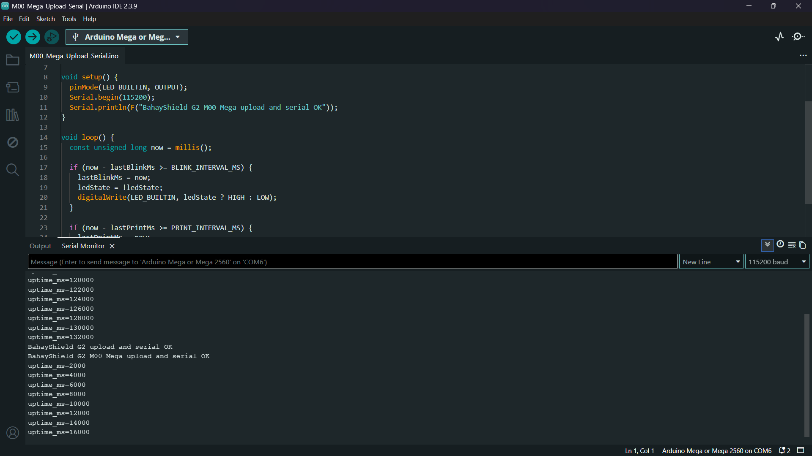
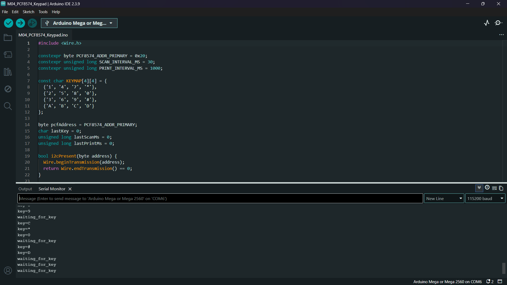
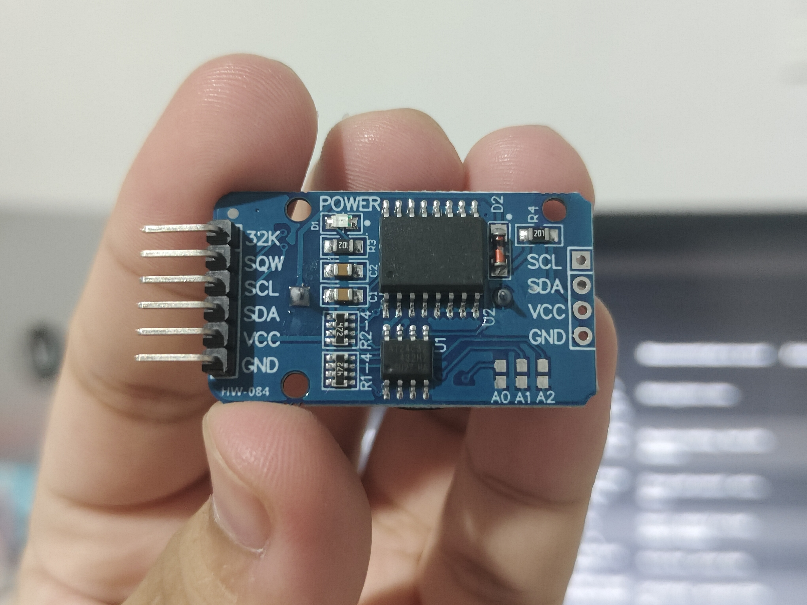

# BahayShield ULTRA

<p align="center">
  <strong>Offline flood and typhoon preparedness controller for a tabletop home-safety demo.</strong><br>
  Arduino Mega 2560 Pro Mini (ATmega2560) · HC-SR04 · BME280 · TRI scoring · low-voltage relay cut
</p>

<p align="center">
  <a href="#overview">Overview</a>
  &nbsp;·&nbsp;
  <a href="#features">Features</a>
  &nbsp;·&nbsp;
  <a href="#hardware">Hardware</a>
  &nbsp;·&nbsp;
  <a href="#quick-start">Quick Start</a>
  &nbsp;·&nbsp;
  <a href="#project-structure">Structure</a>
  &nbsp;·&nbsp;
  <a href="#license">License</a>
</p>

<p align="center">
  
  
  
  
  
  
</p>

## Contents

- [Overview](#overview)
- [Features](#features)
- [Hardware](#hardware)
- [Firmware](#firmware)
- [Photos](#photos)
- [Quick Start](#quick-start)
- [Project Structure](#project-structure)
- [Safety and scope](#safety-and-scope)
- [License](#license)
- [Course Note](#course-note)

## Overview

BahayShield ULTRA is a fully offline microcontroller system that fuses ultrasonic water-level sensing with barometric pressure trend analysis. It computes a Typhoon Risk Index (TRI), drives staged visual and audible alerts, and can open a **low-voltage** demo load path through a relay when risk stays critical long enough.

The build is a **defense-room / tabletop simulation unit**: a control enclosure plus a house diorama with a clear flood tray. It is not a field-installed household electrical product and does not switch AC mains.

**Controller note (factual):**

| Stage | Board | Chip |
|-------|--------|------|
| Early breadboard bring-up | Full-size Arduino Mega 2560 class boards were acceptable for prototyping | ATmega2560 |
| Final assembly / PCB target | **Arduino Mega 2560 Pro Mini** (compact embedded module, typically CH340 USB, 100-mil header pitch for motherboard sockets) | ATmega2560 |

Arduino IDE board target for both form factors: **Arduino Mega or Mega 2560**.

## Features

| Feature | Description |
|---------|-------------|
| Water level | HC-SR04 measures distance to water over a fixed mast geometry; mapped to dry / ankle / knee / waist / critical |
| Barometric trend | BME280 pressure is the compliance environmental channel; rolling slope and baseline feed TRI |
| Storm profiles | Habagat, Bagyo, and Flash Flood reweight water vs pressure contributions |
| TRI + staged alerts | LED bar, alert LED, buzzer cadence, and 20x4 LCD pages track NORMAL → WATCH → WARNING1 → POWER_CUT → EVACUATE |
| Relay cut | Relay 1 uses COM-NC on a 5 V demo load only; active-LOW coil drive with safe-off defaults |
| Operator inputs | PCF8574 4x4 keypad, A1 three-button ladder, and serial commands |
| Event log | DS3231 timestamps + AT24C32 EEPROM records with magic header and checksum |
| Mechanical stack | Custom two-layer KiCad motherboard project, 3D-printed enclosure, separate HC-SR04 mast |

## Hardware

| Block | Part | Role |
|-------|------|------|
| MCU | Arduino Mega 2560 Pro Mini (ATmega2560) | Final controller; 5 V logic; powered on regulated `5V` pin (`VIN` unused) |
| Water | HC-SR04 | Ultrasonic distance over diorama tray |
| Environment | BME280 (I2C, typically `0x76`) | Pressure compliance; temp/humidity display context only |
| RTC + log | DS3231 + AT24C32 | Timekeeping and event log |
| Display | 20x4 I2C LCD (primary `0x27`) | TRI, profile, water, pressure, state |
| Keypad | 4x4 via PCF8574 (`0x20`) | Profile, mute, cut, ack, page |
| Buttons | 3x tactile on A1 ladder | Yellow cut, Blue view, Green ack |
| Indicators | 5 TRI LEDs + alert LED + active buzzer | Staged alert UI |
| Actuator | 2-ch relay module (HL-52S class, Songle 5 V coils) | Relay 1 demo-load cut; Relay 2 spare |
| Power | USB-C PD source → buck (XL4015 preferred) → 5.00 V rails | Fuse + reverse protection on design; USB for programming only |
| Load | 5 V LED strip on Relay 1 COM-NC | Stand-in for ground-floor branch, never AC |
| PCB | KiCad Rev A motherboard | Headers for Pro Mini and modules |
| Enclosure | Printed base, top panel, BME280 vent cage, mast set | Control unit + sensor geometry |

Pin map and I2C addresses: [`hardware/pinout.md`](hardware/pinout.md).  
Power path: [`hardware/power-tree.md`](hardware/power-tree.md).  
BOM summary: [`hardware/bom.md`](hardware/bom.md).

## Firmware

Production sketch: [`firmware/bahayshield-ultra/`](firmware/bahayshield-ultra/).

- Non-blocking `millis()` scheduler
- Fixed-point TRI math suitable for 8 KB SRAM class targets
- Non-blocking HC-SR04 echo state machine
- Active-LOW relay with confirm window before power-cut latch
- Serial monitor at `115200` baud

Bring-up sketches under [`firmware/bring-up/`](firmware/bring-up/) exercise one subsystem at a time (I2C, LCD, keypad, RTC, BME280, relay, ultrasonic, full breadboard integration).

Libraries for production sketch:

```text
Wire
Adafruit BME280
Adafruit Unified Sensor
Adafruit BusIO
```

LCD and PCF8574 keypad use direct `Wire` access (no LiquidCrystal_I2C dependency in production).

## Photos

| Bench bring-up | Modules |
|----------------|---------|
|  |  |
|  |  |

More captures live in [`docs/photos/`](docs/photos/).

## Quick Start

```bash
git clone https://github.com/cikeyz/bahayshield-ultra.git
cd bahayshield-ultra
```

1. Install Arduino IDE (or Arduino CLI).
2. Board: **Arduino Mega or Mega 2560** (matches ATmega2560 on the Pro Mini module).
3. Install Adafruit BME280 and its dependencies.
4. Open `firmware/bahayshield-ultra/bahayshield-ultra.ino`.
5. Upload with the external demo load disconnected.
6. Serial Monitor at `115200`. Confirm I2C devices, LCD, and inactive relay before connecting the LED-strip load path.

Useful serial commands:

| Cmd | Action |
|-----|--------|
| `c` | Manual relay cut |
| `a` | Acknowledge / reset when safe conditions hold |
| `v` | Cycle LCD page |
| `m` | Mute buzzer |
| `1` / `2` / `3` | Habagat / Bagyo / Flash Flood profile |
| `?` | Help |

## Project Structure

```text
bahayshield-ultra/
├── README.md
├── LICENSE
├── .gitignore
├── firmware/
│   ├── bahayshield-ultra/          # production sketch
│   └── bring-up/                   # M00-M16 driver tests
├── hardware/
│   ├── pinout.md
│   ├── power-tree.md
│   ├── bom.md
│   └── wiring-overview.md
├── pcb/
│   ├── README.md
│   ├── rev-a/                      # KiCad Rev A project + libs
│   └── archive/prototype-1/        # early routing baseline
├── enclosure/
│   ├── README.md
│   ├── scad/
│   └── stl/
└── docs/
    ├── overview.md
    ├── demo-procedure.md
    ├── diagrams/
    └── photos/
```

## Safety and scope

- No AC mains, outlets, extension cords, or household branch-circuit switching.
- Relay contacts switch a **5 V demo load** only.
- No outdoor/splash deployment in this project scope.
- BME280 humidity and temperature must not drive TRI, relay cutoff, or evacuate logic; pressure is the compliance channel.
- Storm-pressure demos use an A0 potentiometer for repeatable curves; BME280 still provides real barometric context.

Re-run electrical checks (5.00 V buck set-point, relay active level, COM-NC continuity) before any live demo.

## License

MIT. See [LICENSE](LICENSE).

## Course Note

Built for CMPE 311 (Microprocessor Systems), Polytechnic University of the Philippines, Group 4, A.Y. 2025-2026, under Engr. Rufo I. Marasigan Jr., D.Eng, PCpE. Published here as a standalone engineering portfolio project.
